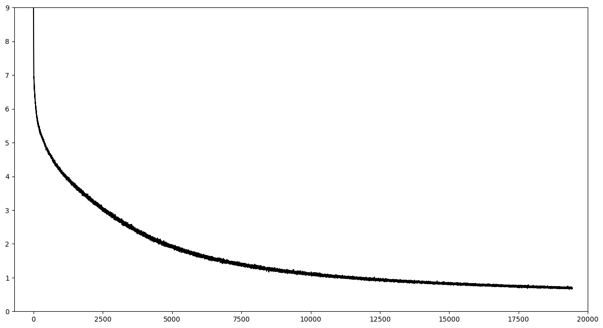

# femtoGPT: крошечная GPT обученная на домашнем пк

## Первая версия femtoGPT готова! Сейчас расскажу как я это сделал.

#### Референс
  Естественно к началу проекта я понимал архитектуру GPT, и понимал как происходит генерация, но абсолютно не было понимания как её обучать. Поэтому я поискал референсы на гитхабе и нашел пару хороших репозиториев, но ничего кроме метода нарезки данных я оттуда не взял)

#### Выбор данных:
  Далее встал вопрос данных: На чем обучать?
  Так как я хотел сделать чисто `русскую модель`(главной мотивацией этого было желание самостоятельно оценить то, что она генерирует) я решил взять датасет с txt файлами `русской классики`(это было не лучшим решением, позже обьясню почему) с Kaggle.
  Оттуда удалось добыть аж 62мб русского текста!

#### BPE-токенизация:
  Дальше я решил, что хотелось бы получить опыт с BPE-токенизацией. Поэтому нашел гугловскую либу `sentencepiece`, это кстати была самая простая часть :)

#### Модель:
  Пришла очередь модели.
  Во первых я изначально понимал, что обучать такую модель на домашнем ПК задача не простая чисто с технической части, поэтому пришлось искать методы ускорения обучения, во вторых мне ПРИШЛОСЬ сделать `очень маленькую модель`, потому что больше просто не влазило на GPU.
  Я написал модель используя классическую архитектуру и используя готовые блоки(можно было бы и написать их самому, проект то учебный, но готовые явно лучше оптимизированы).

#### Эксперименты с гиперпараметрами:
  Я провел несколько экспериментов с гиперпараметрами: я сравнивал модели с разным hidden_dim, learning rate и n_layers. Модели с количеством слоев больше трех сходились дольше моделей с тремя слоями и саи процесс обучения становился дольше в k раз. Поэтому я остановился на модели с `3 слоями`, `hidden_dim = 1024` и `learning_rate = 3e-4`. Размер словаря был всего `8000 токенов`, а количество параметров около `54млн`. Модель с бОльшим hidden_dim просто не влазила на карту, поэтому пришлось остановится на этом.

#### Обучение модели:
  В октябре 23его, когда я только начал этот проект самый большой фейл происходил на обучении. Лосс модели не падал ниже 6 и сама модель спамила запятыми в предиктах. Когда уже в декабре я приступил к проекту заново у меня все получилось! Модель `начала медленно сходится`.
  \
  Через финальную версию модели я прогнал всего `5.000.000 токенов`(я использовал не все 62 мб текста с каггла) и она сделала около `20.000 шагов`, обучалась она чуть дольше суток на `RTX 2070 super`. Я считаю, что для домашнего эксперимента получилось неплохо!

#### График лосса:
  Финальный лосс зафиксировался в районе `0.67`.
  Можно видеть, что модель еще далека от идеала и по моим расчетам до относительно нормального языкового моделирования лоссу следовало бы упасть до примерно 0.3(eсли такое моделирование возможно при таком количестве параметров).
  

#### Генерация текста:
  И теперь самое интересное - генерация)\
  Так как модель обучалась на классике, я попытался дать ей на вход относительно академические тексты:
 - 1) ... «Весна, и любовь, и счастие! — как будто говорил этот дуб. — И как не надоест вам все один и тот же глупый бессмысленный обман! Все одно и то же, и все обман! Нет ни весны, ни солнца, ни счастья. Вон смотрите, сидят задавленные мертвые ели, всегда одинакие, и вон и я растопырил свои обломанные, ободранные пальцы, где ни выросли они — из ...\
Модель продолжила так: \
    `-за вас не до них. И выходят человек с познанием, не потому, что их очень любят, потому что им и ночью ходят, они не знают, а будут испишать. Или им, они слабели, но они сами знают, что им некогда, и они будут счастливы. Они только будут продолжать миры, а они молчат и станут смотреть на их.`\
Это генерация при стандартной температуре и без семплирования. Можно с уверенностью сказать, что это похоже на русский текст, проглядываются навыки пунктуации, но при этом здесь нет вообще никакого смысла, что грустно, но поправимо!\
\
  - 2) ... Деревья в лесу пестрят красками золотой    осени, вот только дуб осыпался полностью, и,  обнажив сухие ветви, раньше всех приготовился к зиме.Ветер с шумом кружит листья. На небе проплывают последние кучевые облака. Грозовых дождей уже не бывает, стремительно холодает одновременно с появлением обильных проливных дождей. В лучах прохладного сентябрьского солнца на ...\
    Модель продолжила так: \
    `подвиги, даже благородные мысли бродили по моим старому, но часто принимала в беседе с моей семью. Филофрон, возносясь с изветами не служение Меркурия, но египетской немой, нанесенной ему смущения, и логика которой лежала на земле, за церковьщим, смотрели ему с первых слов, что весь голос ее прозвучал, как будто поразил в ее.`\
    В этой генерации я уже поигрался и с температурой и с семплированием и это чувствуется, модель достала из словаря очень странные и редкие слова, но тут `чувствуется минус` классических текстов - `нет в них ни знаний для обобщения, ни современной структуры речи.`

    #### Планы развития
    1) Вместе с [[Димой](https://github.com/DimaVik)] `соберем тексты` нормальной русской речи(скорее всего интервью), а также тексты со знаниями(скорее всего вики).
    2) `Продолжу обучение` модели(к сожалению увеличить модель по параметрам получится только если я сильно оптимизирую хранение самой модели и данных)
    3) Попробую `оптимизировать обучение`
